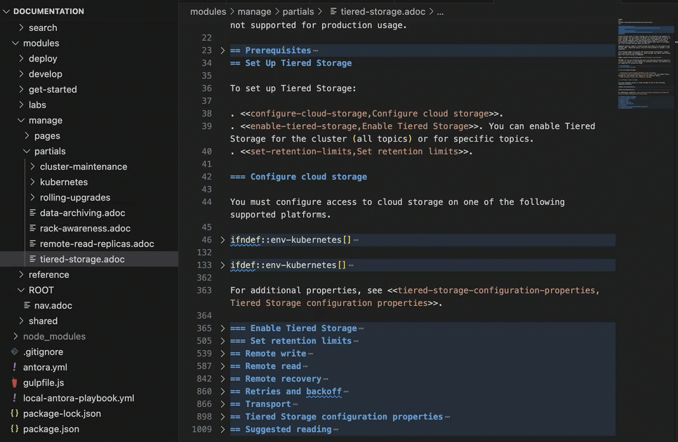

= Contribute to Redpanda Docs
:url-docs: https://docs.redpanda.com
:url-org: https://github.com/redpanda-data
:url-ui: {url-org}/docs-ui
:url-extensions: {url-org}/docs-extensions-and-macros
:url-site: {url-org}/docs-site
:hide-uri-scheme:
:url-netlify: https://netlify.com
:url-nodejs: https://nodejs.org/en/download
:url-netlify-docs: https://docs.netlify.com
:url-antora-docs: https://docs.antora.org
:url-redoc: https://github.com/Redocly/redoc
:idprefix:
:idseparator: -
:experimental:
ifdef::env-github[]
:important-caption: :exclamation:
:note-caption: :paperclip:
endif::[]
:toc:
:toc-title: Contents

The Redpanda docs are open source, and we welcome your contributions!

toc::[]

== Introduction to Antora

Antora is a static site generator that facilitates a docs-as-code workflow. In Antora, documentation is stored in Git repositories and processed to output a static website.

Antora can collect files from a combination of local, remote public, and remote private repositories over any protocol supported by git.

Antora uses https://docs.asciidoctor.org/asciidoctor.js/latest/[Asciidoctor.js] to convert Asciidoc to HTML, then it uses https://handlebarsjs.com/guide/#introduction[Handlebars] to set that HTML into a page layout.

The Handlebars templates and other frontend elements, such as CSS and JavaScript, are stored in a {url-ui}[separate repository]. The UI is served in a `ui-bundle.zip` file that is made available in GitHub release and referenced in the playbook.

Learn more about Antora in this introduction on YouTube.

ifdef::env-github[]
image::https://img.youtube.com/vi/BAJ8F7yQz64/maxresdefault.jpg[link=https://youtu.be/BAJ8F7yQz64]
endif::[]

ifndef::env-github[]
video::BAJ8F7yQz64[YouTube]
endif::[]

== Choose a way to contribute

To contribute to the Redpanda docs, you have the following options:

|===
|Option|Description

|<<Open an issue>>
|Suggest a change by opening an issue on GitHub.

|<<Contribute content>>
|Make changes directly to the documentation and submit them through a pull request.

|===

=== Open an issue

The Redpanda docs team uses GitHub issues to track, plan, and prioritize tasks. To suggest changes, you can create an issue, which the team will then evaluate:

. <<find-content, Find the repository>> where the docs are hosted.
. Verify whether a similar issue already exists in that repository to avoid duplication.
. Go to **Issues** > **New Issue** to create a new issue.

You have the option to assign the issue to yourself or leave the assignee field blank. The Redpanda docs team triages all new issues and will allocate a writer if one isn't already assigned.

=== Contribute content

You have two options to contribute to the documentation:

. Directly edit a page on GitHub by selecting **Make a contribution** > **Edit on GitHub** located at the bottom of a documentation page.
. Clone the docs repository to make changes locally on your machine. For a guide, see <<Submit your first contribution>>.

If you're looking for an open issue to fix, check the open docs issues. If you find an issue you'd like to work on:

- If the issue is already assigned to someone else, please consider another one.
- If the issue is unassigned, add a comment expressing your interest in working on it.

== Submit your first contribution

This section helps you get started with your first contribution by running through the steps for making a change.

=== Prerequisites

To generate the site, you must have {url-nodejs}[Node.js] 16 or higher installed on your machine.

[,bash]
----
node --version
----

If this command fails, you don't have Node.js installed.

We recommend using https://code.visualstudio.com/download[Visual Studio Code] with the https://marketplace.visualstudio.com/items?itemName=asciidoctor.asciidoctor-vscode[Asciidoc extension] to edit documentation. The Asciidoc extension provides useful features such as folding conditionals and titles to make it easier to work with large documents.

=== Clone the Redpanda docs repository

Documentation is hosted in GitHub repositories. To work on a particular documentation repository, clone it on your local machine.

TIP: You can find all documentation repositories in the `antora-playbook.yml` file under `content.sources`. See <<find-content, Find content>>

. Clone the repository, and check out the branch that you want to work on.
+
[source,bash,subs=attributes+]
----
git clone {url-org}/documentation
cd documentation
----
+
IMPORTANT: If you're not a Redpanda employee, you'll need to fork the repository and work on your local fork instead.
+
The default `main` branch contains the latest version of the Redpanda docs. To work on an older version check out the versioned branch. For example:
+
[source,bash]
----
git checkout v/22.3
----

. Create a new branch for your changes.
+
[source,bash]
----
git checkout -b <branch-name>
----

=== Make your changes

After cloning a docs repository and checking out a new local branch, you're ready to make your changes.

[TIP]
====
- For help navigating a docs repository, see the <<structure, Docs Structure section>>.
- For rules and recommendations as well as help with Asciidoc syntax, see the link:./STYLE-GUIDE.adoc[Redpanda documentation style guide].
====

=== Build and test your changes locally

When working on a docs project, you should build and preview the docs on your local machine to see your changes before going live.

The repository contains a script that watches Asciidoc files in the `pages/` directories and `antora.yml` files in your local repository and triggers a new Antora build when it detects changes to those files.
The script also starts a web server and can use LiveReload to reload the browser tab after the Antora build completes.

To use the script:

. Install dependencies.
+
[,bash]
----
npm update
----

. If you're using Chrome, install the LiveReload https://chrome.google.com/webstore/detail/livereload/jnihajbhpnppcggbcgedagnkighmdlei?hl=en[chrome extension].

. Start the build.
+
[,bash]
----
npm run start
----
+
The build first generates the site then serves the files in the output directory using a local web server.
+
The web server's host URL is printed to the console after the `watch` task completes.
+
The console output prints status information every time a change is detected.
+
....
[17:33:59] Starting 'generate'...
[17:34:02] Finished 'generate' after 3.35 s
....

. Make changes to your AsciiDoc files locally.
The browser tab should automatically reload after a short while.

. Use kbd:[Ctrl+C] to stop the process.

[TIP]
====
If you don't want to use the live reload script, you can build the site and serve its static contents using this command:

[source,bash]
----
npm run build
npm run serve
----
====

=== Submit your changes

After making your changes, and testing how they look, you're ready to submit them to GitHub for review.

. Stage your changes for commit.
+
[source,bash]
----
git add <filenames>
----

. Commit your changes.
+
[source,bash]
----
git commit -m "Concise message that describes your changes"
----

. Push your local branch to the remote repository.

. In the GitHub UI, open a pull request.

Thanks! We'll review your changes and provide feedback and guidance as necessary.

== Find content

All content served on the docs site is fetched from GitHub repositories listed under `content.sources` in the link:../antora-playbook.yml[playbook].

For example:

[,yaml,subs=attributes+]
----
content:
  sources:
  - url: {url-site} <1>
    branches: main
    start_paths: [site-search, home, api]
  - url: https://github.com/redpanda-data/documentation <2>
    branches: [v/*]
----

<1> Clone this repository to work on the main playbook, the home page, the OpenAPI docs, or the site search.
<2> Clone this repository to work on Redpanda docs.

=== Docs structure

All content repositories are organized according to the same content hierarchy.

----
📒 repository <1>
  📄 antora.yml <2>
  📂 modules <3>
    📂 ROOT <4>
      📁 attachments <5>
      📁 examples <6>
      📁 images <7>
      📁 pages <8>
      📁 partials <9>
      📄 nav.adoc <10>
    📂 another-module <11>
      📁 pages
  📁 packages <12>
----

<1> (Required) The repository root and the content source root. Antora assumes the content source root is at the root of a repository unless the `start_path` or `start_paths` key is assigned a value on a content source in the site’s playbook.
<2> (Required) A component version descriptor file, named `antora.yml`, is required at each content source root. An `antora.yml` file indicates to Antora that the contents of a directory named `modules/` should be collected and processed.
<3> (Required) A `modules/` directory must be located at the same hierarchical level as an `antora.yml` file in a content source root.
<4> (Optional) Antora applies special behavior to the publishable resources in a ROOT module directory. ROOT is a reserved directory name and must be in all uppercase letters. A module directory must contain at least one family directory.
<5> (Optional) Attachments family directory (reserved directory name).
<6> (Optional) Examples family directory (reserved directory name).
<7> (Optional) Images family directory (reserved directory name).
<8> (Optional) Pages family directory (reserved directory name).
<9> (Optional) Partials family directory (reserved directory name).
<10> (Required) Nav tree file named `nav.adoc`.
<11> (Optional) named module directory. You can create as many named module directories as you require. A module directory must contain at least one family directory.
<12> Antora won’t process the files in this directory because it’s located outside the `modules/` directory.

TIP: Learn more about the Antora structure in the docs: {url-antora-docs}/antora/latest/organize-content-files/[How to Organize Your Content Files].

== Mark a version as end of life

When a version of the docs reaches end of life, you can mark it as such in the `antora.yml` file.

.`antora.yml`
[,yaml]
----
asciidoc:
  attributes:
    page-eol: true
----

When a component version includes this attribute, a banner is displayed at the top of the page to warn users that the version is no longer supported. A link to the latest version is provided.

== Hide a component from the product selector

By default, Antora adds all components to the dropdown selector in the UI.
If you don't want a component to appear in the dropdown, add the `page-exclude-from-dropdown-selector: true` attribute to the `antora.yml` file of each component version.

.`antora.yml`
[,yaml]
----
asciidoc:
  attributes:
    page-exclude-from-dropdown-selector: true
----

For example, we use this attribute for the `home` component because the UI has been customized to provide a link to the home page at the top of each nav tree.

== Create index pages

Index pages are docs topics that provide links to their top-level child topics in the nav tree.

For example:

....
* xref:get-started:index.adoc[Get Started] <1>
** xref:get-started:intro-to-events.adoc[Introduction to Redpanda]
** xref:get-started:architecture.adoc[How Redpanda Works]
** xref:get-started:licenses.adoc[Redpanda Licensing]
** xref:get-started:quick-start.adoc[Redpanda Quickstart]
** xref:get-started:rpk-install.adoc[Introduction to rpk]
** xref:get-started:code-examples.adoc[Build a Sample Application]
....

<1> This page is an index. After the build, it will contains the titles and descriptions of all the topics underneath it.

To create an index page, give it a title and the `page-layout: index` attribute.

....
= Example Index Page
page-layout: index
....

The UI takes care of generating the links from the titles and description attributes on each child page.

== Move, delete, or rename pages

If you move, delete, or rename pages, you must redirect those page URLs to an existing page in the docs using the `page-aliases` attribute.

The `page-aliases` attribute is set in the page header of a target page using an attribute entry. The target page refers to the page you're redirecting a source page to. The source page refers to the deleted, renamed, or moved page that you're redirecting from. A source page's resource ID (its resource ID before it was deleted, renamed, or moved) is assigned to the `page-aliases` attribute in a target page. Multiple resource IDs can be assigned to the attribute in a comma-separated list.

....
= Title of Target Page
:page-aliases: deleted-page-filename.adoc, renamed-page-filename.adoc
....

Antora calculates the URL for a source page's resource ID and generates redirect information so that the source page URL redirects to the target page URL. Any coordinates, such as version or component, that aren't specified in a resource ID assigned to page-aliases are interpolated from the target page's coordinates. The generated output format of the redirect information is determined by your chosen redirect facility.

NOTE: A resource ID assigned to a page-aliases attribute can be used in an xref. Therefore, if you delete, rename, or move a page, you don't need to update any references to it in your source files.

The content of the page-aliases attribute are used to create Netlify redirects in the `_redirects` file at build time.

IMPORTANT: Make sure that links are relative to the current component version. Do not link to specific versions in page aliases.

== Single-sourcing

Practice the DRY (Don't Repeat Yourself) principle by single-sourcing repeated content. Common examples of single-sourced content include prerequisites, contact info, and foundational steps of how-to guides.

Antora supports single-sourcing Asciidoc files that are located in the `partials/` directory. For details about partials, see {url-antora-docs}/antora/latest/page/partials/[Partials] in the Antora docs.

NOTE: You can include partials inside other partials.

Inside partials, you can conditionally render content depending on attributes that are available on the page that you include them in.

For example:

[,asciidoc,subs=none]
----
\ifndef::env-kubernetes[]
This will be rendered only if the pages you include the partial in do not have the `env-kubernetes` attribute.
\endif::[]

\ifdef::env-kubernetes[]
This will be rendered only if the pages you include the partial in has the `env-kubernetes` attribute.
\endif::[]
----

If you need to link to different pages in partials depending on the context of the page that you include them in, you can define attributes at the top of the page to hold the links. For example:

[,asciidoc]
----
\ifdef::env-kubernetes[]
:data-archiving-link: manage:kubernetes/data-archiving.adoc
\endif::[]
\ifndef::env-kubernetes[]
:data-archiving-link: manage:data-archiving.adoc
\endif::[]

To learn more, see xref:{data-archiving-link}[Data Archiving]
----

== Update the nav tree

All doc repositories use a single navigation file for the nav tree, which is defined in the `nav.adoc` file of the `ROOT` module.

To update the nav tree, edit the `nav.adoc` file.

For more information about navigation files, see the {url-antora-docs}/antora/latest/navigation/include-lists/[Antora docs].

== Style guide

For rules and recommendations as well as help with Asciidoc syntax, see the link:./STYLE-GUIDE.adoc[Redpanda docs style guide].

== Troubleshooting

=== Reference validation

Reference validation, which covers xrefs, includes, and images, is performed automatically when Antora runs.
The validation errors will be shown in the log output.

If your build includes reference violations, such as broken xrefs, a report of those violations is printed to the terminal or CI log.
Here's an excerpt from that report:

....
[13:41:05.047] ERROR (asciidoctor): target of xref not found: redpanda:how-redpanda-works.adoc
    file: modules/get-started/pages/architecture.adoc
    source: https://github.com/redpanda-data/documentation (branch: v/22.3)
....

Each message shows the repository source, the refname, and the path from the root of that repository.

== Contact us

Get in touch with the Redpanda docs team on https://redpanda.com/slack[Slack] in the #docs channel.